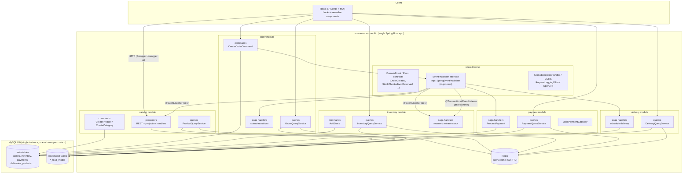

# Component diagram — ecommerce-monolith

```mermaid
graph TB
    subgraph Client["Client"]
        UI["React SPA (Vite + MUI)<br/>hooks + reusable components"]
    end

    subgraph App["ecommerce-monolith (single Spring Boot app)"]

        subgraph SK["shared-kernel"]
            DE["DomainEvent / Event contracts<br/>(OrderCreated, StockCheckedAndReserved, ...)"]
            EP["EventPublisher interface<br/>impl: SpringEventPublisher (in-process)"]
            INFRA["GlobalExceptionHandler / CORS<br/>RequestLoggingFilter / OpenAPI"]
        end

        subgraph CAT["catalog module"]
            CATC["commands<br/>CreateProduct / CreateCategory"]
            CATQ["queries<br/>ProductQueryService"]
            CATP["presenters<br/>REST + projection handlers"]
        end

        subgraph INV["inventory module"]
            INVC["commands<br/>AddStock"]
            INVQ["queries<br/>InventoryQueryService"]
            INVS["saga handlers<br/>reserve / release stock"]
        end

        subgraph ORD["order module"]
            ORDC["commands<br/>CreateOrderCommand"]
            ORDQ["queries<br/>OrderQueryService"]
            ORDS["saga handlers<br/>status transitions"]
        end

        subgraph PAY["payment module"]
            PAYS["saga handlers<br/>ProcessPayment"]
            PAYQ["queries<br/>PaymentQueryService"]
            GW["MockPaymentGateway"]
        end

        subgraph DEL["delivery module"]
            DELS["saga handlers<br/>schedule delivery"]
            DELQ["queries<br/>DeliveryQueryService"]
        end

        REDIS[("Redis<br/>query cache (60s TTL)")]
    end

    subgraph DB["MySQL 8.0 (single instance, one schema per context)"]
        W[(write tables<br/>orders, inventory, payments,<br/>deliveries, products, ...)]
        R[(read-model tables<br/>*_read_model)]
    end

    UI -->|"HTTP (Swagger: /swagger-ui)"| CATP
    UI --> ORDC
    UI --> ORDQ
    UI --> INVQ
    UI --> PAYQ
    UI --> DELQ

    ORDC --> EP
    EP -->|"@EventListener (in-tx)"| CATP
    EP -->|"@EventListener (in-tx)"| INVS
    EP -->|"@TransactionalEventListener (after commit)"| INVS
    EP --> PAYS
    EP --> DELS
    EP --> ORDS

    CATC --> W
    ORDC --> W
    INVC --> W
    PAYS --> W
    DELS --> W
    CATP --> R
    CATQ --> R
    INVQ --> R
    ORDQ --> R
    PAYQ --> R
    DELQ --> R
    CATQ --> REDIS
    ORDQ --> REDIS
    INVQ --> REDIS
    PAYQ --> REDIS
    DELQ --> REDIS
```
